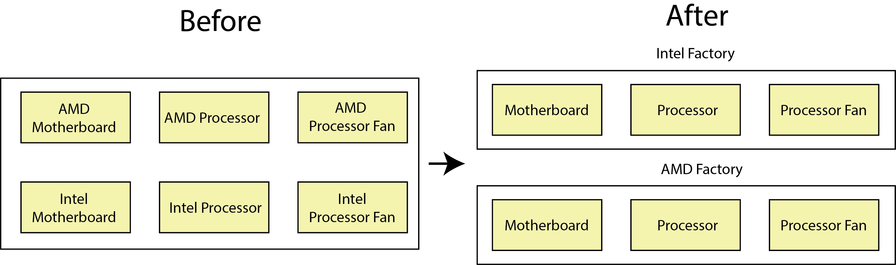
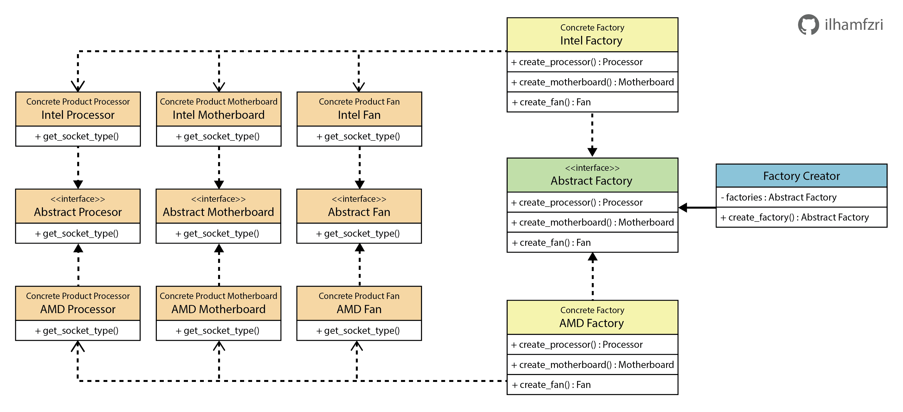

# Abstract Factory

*Abstract Factory* merupakan salah dari *creational design pattern* yang bertujuan untuk membuat *family* atau sekumpulan objek yang memiliki sifat sama tanpa secara langsung kita spesifikasikan classnya. Ada yang mengatakan *Abstract Factory* ini adalah membuat *factory* melalui *factory* atau "Factory of factories". Jika kamu belum ngerti apa itu *factory*, bisa baca dulu tentang *factory method* [di sini](../01_factory_method/README.md). 

## Kapan Abstract Factory Digunakan ?
Sebagai contoh terdapat kasus dimana kita mempunyai tiga buah objek komponen dalam komputer yaitu, motherboard, processor, dan fan processor. Seperti yang kita ketahui bahwa setiap motherboard tidak mungkin support untuk semua jenis processor, dikarenakan setiap processor terutama yang berbeda vendor memiliki bentuk socket yang berbeda dan begitu pula dengan fan processornya yang harus menyesuaikan jenis processor tersebut. Pada kasus ini penulis simplikasi dengan mengasumsikan bahwa setiap motherboard, processor, dan fan processor yang dihasilkan support satu sama lain pada vendor yang sama.


Berdasarkan gambar diatas, jika sebelum menggunakan *abstract factory* kita harus mendefinisikan jenis vendor  dan objek setiap kali akan mengaksesnya yang dimana ini akan memberatkan dari sisi client code karena harus menghapalkan semua objek dari masing-masing vendor tersebut. Dengan *abstract factory* kita mengelompokan setiap objek sesuai dengan vendornya seperti yang ditunjukan pada gambar di atas, terdapat dua buah vendor factory yaitu, `Intel Factory` dan `AMD Factory`.

## Struktur Abstract Factory

#### 1. Abstract Products :
`Abstract products` adalah bagian untuk menyimpan interface atau kontrak yang dimana setiap variant dari objek harus mengikuti interface ini, yang artinya seperti pada contoh setiap `concrete products` harus memiki fungsi `get_socket_type()`. Pada kasus ini terdapat tiga buah `abstract products`, yaitu `abstract processor`, `abstract motherboard`, dan` abstract fan`. Pada implementasi realcasenya setiap jenis `abstract products` boleh memiliki interface yang berbeda-beda sesuai dengan business logicnya.

#### 2. Concrete Products :
`Concrete products` adalah bagian untuk menyimpan implementasi dari setiap variant produk yang terikat dengan `abstract products`. Pada kasus ini contohnya `AMD Processor` akan memiliki fungsi `get_socket_type()` yang akan mengembalikan jenis socket yang digunakan oleh vendor AMD.

#### 3. Abstract Factory :
`Abstract factory` berfungsi untuk menyimpan interface jenis produk apa saja yang akan dihasilkan oleh setiap `factory`. Pada kasus ini terdapat tiga, yaitu fungsi `create_processor()`, `create_motherboard()` dan `create_fan`.

#### 4. Concrete Factory:
`Concrete factory` adalah bagian yang berfungsi untuk menghasilkan `concrete product` yang terikat dengan interface `abstract factory`. Pada contoh `AMD Factory` berfungsi untuk menghasilkan produk objek dari `AMD Processor`, `AMD Motherboard` dan `AMD Fan`

#### 5. Factory Creator:
`Factory creator` adalah bagian berfungsi untuk menghasilkan *concrete factory*. Bagian ini juga yang akan langsung diakses oleh client code. 


## Implementasi
1. Langkah pertama kita buat terlebih dahulu `abstract products` untuk `Processor`, `Motherboard` dan `Fan`.
    ```python
    ## factory/abstract_products.py

    from abc import ABC, abstractmethod

    class CPU(ABC):
        """
        Creates "Abstract CPU"
        """

        @abstractmethod
        def get_socket_type(self) -> str:
            pass

    class Motherboard(ABC):
        """
        Create "Abstract Motherboard"
        """

        @abstractmethod
        def get_socket_type(self) -> str:
            pass

    class Fan(ABC):
        """
        Create "Abstract Fan"
        """

        @abstractmethod
        def get_socket_type(self) -> str:
            pass
    ```

2. Selanjutnya, kita implementasi `concrete products` untuk masing - masing vendor meliputi `Processor`, `Motherboard` dan `Fan`.
    ```python
    ## factory/intel_products.py

    from .abstract_products import CPU, Motherboard, Fan

    class IntelCPU(CPU):
        """
        Type: Concrete Product
        Abstract methods of the CPU base class are implemented.
        """

        def get_socket_type(self) -> str:
            return "Intel CPU Socket"
        
    class IntelMotherboard(Motherboard):
        """
        Type: Concrete Product
        Abstract methods of the Motherboard base class are implemented.
        """

        def get_socket_type(self) -> str:
            return "Intel CPU Socket"
        

    class IntelFan(Fan):
        """
        Type: Concrete Product
        Abstract methods of the Fan base class are implemented.
        """
        def get_socket_type(self) -> str:
            return "Intel CPU Socket"
    ```

    ```python
    ## factory/amd_products.py

    from .abstract_products import CPU, Motherboard, Fan

    class AmdCPU(CPU):
        """
        Type: Concrete Product
        Abstract methods of the CPU base class are implemented.
        """

        def get_socket_type(self) -> str:
            return "AMD CPU Socket"
        
    class AmdMotherboard(Motherboard):
        """
        Type: Concrete Product
        Abstract methods of the Motherboard base class are implemented.
        """

        def get_socket_type(self) -> str:
            return "AMD CPU Socket"
        

    class AmdFan(Fan):
        """
        Type: Concrete Product
        Abstract methods of the Fan base class are implemented.
        """
        def get_socket_type(self) -> str:
            return "AMD CPU Socket"
    ```

3.  Sebelum membuat `factory` untuk masing-masing vendor/families, kita buat `abstract factory` terlebih dahulu.
    ```python
    ## factory/abstract_factory.py

    from abc import ABC, abstractmethod
    from .abstract_products import CPU, Motherboard, Fan

    class AbstractFactory(ABC):
        """
        The AbstractFactory
        """

        @abstractmethod
        def create_processor(self) -> CPU:
            pass

        @abstractmethod
        def create_motherboard(self) -> Motherboard:
            pass

        @abstractmethod
        def create_fan(self) -> Fan:
            pass
    ```

4.  Setelah membuat `abstract factory`, kemudian kita implementasikan fungsi untuk menghasilkan `concrete factory` pada masing-masing `concrete factory` yaitu `IntelFactory` dan `AMDFactory` .

    ```python
    ## factory/intel_factory.py

    from .abstract_factory import AbstractFactory
    from .abstract_products import CPU, Motherboard, Fan
    from .intel_products import IntelCPU, IntelMotherboard, IntelFan

    class IntelFactory(AbstractFactory):
        """
        Type: Concrete Factory
        Implement the operations to create concrete product objects.
        """

        def create_processor(self) -> CPU:
            return IntelCPU()
        
        def create_motherboard(self) -> Motherboard:
            return IntelMotherboard()
        
        def create_fan(self) -> Fan:
            return IntelFan()
    ```

    ```python
    ## factory/amd_factory.py

    from .abstract_factory import AbstractFactory
    from .abstract_products import CPU, Motherboard, Fan
    from .amd_products import AmdCPU, AmdMotherboard, AmdFan

    class AMDFactory(AbstractFactory):
        """
        Type: Concrete Factory
        Implement the operations to create concrete product objects.
        """

        def create_processor(self) -> CPU:
            return AmdCPU()
        
        def create_motherboard(self) -> Motherboard:
            return AmdMotherboard()
        
        def create_fan(self) -> Fan:
            return AmdFan()
    ```

5. Langkah selanjutnya adalah membuat `FactoryCreator`yang berfungsi untuk menghasilkan `concrete factory`
    ```python
    ## factory/factory_creator.py

    from .abstract_factory import AbstractFactory
    from .amd_factory import AMDFactory
    from .intel_factory import IntelFactory

    class FactoryCreator:
        def __init__(self):
            self.factories = {
                "intel": IntelFactory,
                "amd": AMDFactory,
            }

        def create_factory(self, name) -> AbstractFactory:
            if name in self.factories.keys():
                return self.factories[name]()
            else:
                raise Exception('f factory with {name} name not supported!')
    ```

6. Terakhir, pada client code kita dapat mengakses objek dari masing-masing vendor sebagai berikut.
    ```python
    ## main.py

    from factory.factory_creator import FactoryCreator

    def main():
        factoryCreator = FactoryCreator()
        
        intelFactory = factoryCreator.create_factory("intel")
        amdFactory = factoryCreator.create_factory("amd")

        for factory in [intelFactory,amdFactory]:
            cpu = factory.create_processor()
            motherboard = factory.create_motherboard()
            fan = factory.create_fan()

            print(f'Socket Type Product CPU  = {cpu.get_socket_type()}')
            print(f'Socket Type Product Motherboard  = {motherboard.get_socket_type()}')
            print(f'Socket Type Product Fan  = {fan.get_socket_type()}')


    if __name__ == '__main__':
        main()
    ```

    Output
    ```sh
    Socket Type Product CPU  = Intel CPU Socket
    Socket Type Product Motherboard  = Intel CPU Socket
    Socket Type Product Fan  = Intel CPU Socket
    Socket Type Product CPU  = AMD CPU Socket
    Socket Type Product Motherboard  = AMD CPU Socket
    Socket Type Product Fan  = AMD CPU Socket 
    ```

## Kelebihan dan Kekurangan Abstract Factory
[✅] Client code tidak akan terlalu terikat dengan *product*</br>
[✅] Kita dapat yakin bahwa *product* atau objek yang dihasilkan oleh *factory* akan compatible satu sama lain <br>
[✅] Single Responsibility Principle, karena pembuatan variant *product* tersentralisasi pada *factory*.<br> 
[✅] Open/Closed Principle, kita dapat lebih mudah untuk menambahkan vendor/family *factory* baru tanpa takut merusak *factory* yang sudah ada<br> 

[❌] Kode akan menjadi kompleks apabila jumlah dari variant object untuk setiap factory membesar selain itu kita harus selalu menjaga interface antar factory sesuai</br>