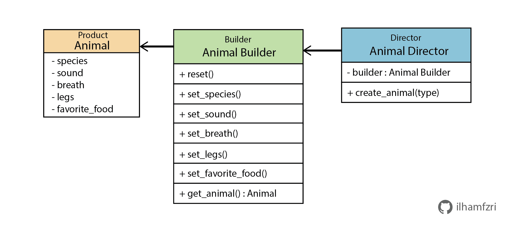

# Builder

*Builder* adalah salah satu dari *creational design patterns* yang bertujuan untuk membuat objek yang kompleks dengan cara *step by step*. Dengan *builder* kita dapat membuat berbagai macam jenis tipe atau representasi dari objek dengan menggunakan code yang sama pada saat membangunnya.

## Kapan Builder Digunakan ?
Sebagai contoh kita memiliki kasus untuk membuat sebuah objek yang dimana memiliki banyak variasi yang mungkin terjadi contohnya adalah Animal. Variasi dari animal ini ditentukan oleh atribut `species` seperti anjing atau kucing, atribut `sound` contohnya "Woof" pada anjing, atribut `breath` yaitu bernafas menggunakan air atau udara, atribut `legs` yaitu jumlah kakinya, dan paramter `favorite food` yaitu makanan favoritenya. 

Solusi paling simpel kita dapat langsung memanggil class `Animal` lalu memasukan kombinasi dari setiap atributnya sesuai dengan spesies binatang tersebut, seperti yang ditunjukan pada snipset code di bawah ini.
```python
cat = Animal("Cat", "Meow", "Air", 4, "Fish")
bird = Animal("Dog", "Woof", "Air", 2, "Seeds")

```
Namun, kelemahan dari solusi diatas adalah seiring bertambahnya atribut dari `Animal` maka kita harus menambahkan atribut baru lagi pada saat inisialiasi yang belum tentu atribut tersebut relevan. Lalu dari sisi client code perlu mengingat urutan dari inisialisasi atribut, meskipun saat ini dapat terbantu oleh IDE tetapi masih dapat berisiko terjadinya kesalahan. Selain itu, kita juga harus menyesuaikan lagi client code apabila menambahkan atribut baru atau bahkan untuk kasus paling buruk kita harus memodifikasi kode test secara menyeluruh yang dimana tidak efisien.

```python
someAnimal= Animal("Cat", "Meow", "Air", 4, "Fish", ..., ...)
```

Solusi yang dapat digunakan untuk masalah tersebut adalah menerapakan `Builder` pattern yaitu dengan memisahkan proses pembuatan variasi dari objek langsung dari class `Animal` dan memindahkan proses pembuatan class `Animal` ke objek yang lain atau disebut dengan `builder`.

Class atau objek `Builder` akan memiliki berbagai macam method untuk mengatur atribut dalam pembuatan class `Animal`, seperti `set_sound()`, `set_breath()`.

Mungkin terdapat pertanyaan lalu bagaimana mengatur urutan ataupun atribut dalam pembuatannya?. Jawabannya adalah kita perlu satu lagi objek atau class yang disebut dengan `Director`. `Director` ini berfungsi untuk mengatur method apa saja dan atribute seperti apa yang perlu dipanggil oleh `Builder` untuk membuat class `Animal` tertentu. Bisa diibaratkan kalau `Builder` itu adalah kuli dan `Director` itu adalah mandornya.


## Struktur Builder

### 1. Product
`Product` adalah objek yang akan dibuat, pada kasus ini adalah class dari `Animal`.

### 2. Builder
`Builder` adalah objek yang menyimpan berbagai method untuk memodifikasi `Product` atau `Animal`. Pada kasus ini `Builder` direpresentasikan oleh `Animal Builder`.

### 3. Director
`Director` adalah objek yang berfungsi untuk mengatur urutan method dan juga atribut pada saat `Builder` atau `Animal Builder` membuat `Product`/`Animal`. Pada kasus ini `Director` direpresentasikan oleh `Animal Director`

## Implementasi 
1. Langkah pertama buat `Product` terlebih dahulu yaitu class dari `Animal`.
    ```python
    ## animal/animal.py

    class Animal:
        def __init__(self):
            self.species = None
            self.sound = None
            self.breath = None
            self.legs = None
            self.favorite_food = None
    ```

2. Setelah itu, buat `AnimalBuilder` yang dimana memuat method untuk memodifikasi class `Animal`.
    ```python
    ## animal/builder.py

    from .animal import Animal

    class AnimalBuilder():
        def __init__(self):
            self.reset()

        def reset(self):
            self.animal = Animal()
        
        def set_species(self, species:str):
            self.animal.species = species
        
        def set_sound(self, sound:str):
            self.animal.sound = sound
        
        def set_breath(self, breath:str):
            self.animal.breath = breath
        
        def set_legs(self, legs:int):
            self.animal.legs = legs

        def set_favorite_food(self, favorite_food:str):
            self.animal.favorite_food = favorite_food
        
        def get_animal(self) -> Animal:
            return self.animal
    ```

3. Selanjutnya, buat `AnimalDirector` yang berfungsi untuk membuat `Animal` melalui `AnimalBuilder` selain itu pada bagian ini terdapat urutan untuk membuat variant dari `Animal`.
    ```python
    ## animal/director.py

    from .builder import AnimalBuilder
    from .animal import Animal

    class AnimalDirector():
        def __init__(self):
            self.builder = AnimalBuilder()

            self.animal_recipe = {
                "cat":self.build_cat,
                "dog":self.build_dog,
                "bird":self.build_bird,
                "fish":self.build_fish,
            }

        def  create_animal(self, type:str):
            if type in self.animal_recipe.keys():
                return self.animal_recipe[type]()
            else:
                raise Exception(f'animal with {type} type not supported!')

        def build_cat(self) -> Animal:
            self.builder.reset()
            self.builder.set_species("Cat")
            self.builder.set_sound("Meow")
            self.builder.set_breath("Air")
            self.builder.set_legs(4)
            self.builder.set_favorite_food("Fish")
            return self.builder.get_animal()

        def build_dog(self) -> Animal:
            self.builder.reset()
            self.builder.set_species("Dog")
            self.builder.set_sound("Wouf")
            self.builder.set_breath("Air")
            self.builder.set_legs(4)
            self.builder.set_favorite_food("Meat")
            return self.builder.get_animal()

        def build_bird(self) -> Animal:
            self.builder.reset()
            self.builder.set_species("Bird")
            self.builder.set_sound("Tweet tweet")
            self.builder.set_breath("Air")
            self.builder.set_legs(2)
            self.builder.set_favorite_food("Seeds")
            return self.builder.get_animal()

        def build_fish(self) -> Animal:
            self.builder.reset()
            self.builder.set_species("Fish")
            self.builder.set_sound("...")
            self.builder.set_breath("Water")
            self.builder.set_legs(0)
            self.builder.set_favorite_food("Plankton")
            return self.builder.get_animal()
    ```

4. Terakhir, setelah `AnimalDirector` dibuat kita dapat membuat berbagai macam variant objek dari `Animal` pada client code langsung dari `AnimalDirector`.

    ```python
    ## main.py

    from animal.director import AnimalDirector

    def main():
        animalDirector = AnimalDirector()
        cat = animalDirector.create_animal("cat")
        dog = animalDirector.create_animal("dog")
        bird = animalDirector.create_animal("bird")
        fish = animalDirector.create_animal("fish")

        for animal in [cat, dog, bird, fish]:
            print(f"\nSpecies : {animal.species}")
            print(f"Sound : {animal.sound}")
            print(f"Breath : {animal.breath}")
            print(f"Legs : {animal.legs}")
            print(f"Favorite Food : {animal.favorite_food}")


    if __name__ == '__main__':
        main()

    ```

    Output
    ```sh
    Species : Cat
    Sound : Meow
    Breath : Air
    Legs : 4
    Favorite Food : Fish

    Species : Dog
    Sound : Wouf
    Breath : Air
    Legs : 4
    Favorite Food : Meat

    Species : Bird
    Sound : Tweet tweet
    Breath : Air
    Legs : 2
    Favorite Food : Seeds

    Species : Fish
    Sound : ...
    Breath : Water
    Legs : 0
    ```


## Kelebihan dan Kekurangan Builder
[✅] Kita dapat menggunakan kode yang sama dalam membangun berbagai macam jenis `product` tinggal mengatur dari sisi `Director`</br>
[✅] Sin­gle Respon­si­bil­i­ty Prin­ci­ple karena proses kompleks dalam pembuatan `product` tersentralisasi pada `director`</br>
[❌] Terkadang kode menjadi semakin kompleks pada `director`, karena setiap kali memerlukan variant `product` baru maka `director` harus menyesuaikan kebutuhan tersebut</br>

