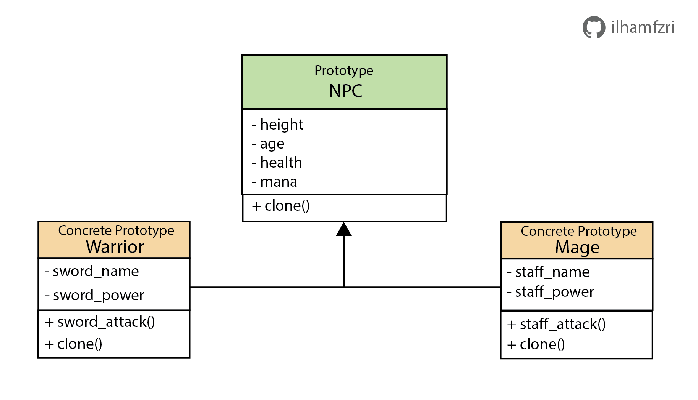

# Prototype
*Prototype* adalah salah satu dari *creational design pattern* yang dimana kita dapat menghasilkan suatu objek dengan melakukan proses cloning dari objek yang sudah ada. 

## Kapan Prototype Digunakan ?
Sebagai contoh kita memiliki kasus yaitu membuat 200 objek NPC pada suatu game yang memiliki tipe yang sama tetapi kita ingin setiap objek tersebut dapat dimodifikasi dengan tanpa mempengaruhi objek NPC yang lain. Solusi paling mudah yaitu kita dapat melakukan iterasi sebanyak 200 kali dimana setiap iterasi kita membuat NPC yang baru. Kelemahan dari solusi sebelumnya adalah jika setiap kali inisialisasi objek membutuhkan waktu yang lama, anggap 2 detik karena kita harus akses database untuk mengambil berbagai parameter dari objek maka total kita butuh sekitar 400 detik untuk proses tersebut yang dimana sangat lama sekali.

Berdasarkan kelemahan solusi sebelumnya maka kita dapat atasi dengan menggunakan *prototype pattern*. Alih-alih membuat setiap objek NPC pada setiap iterasi kita dapat menghasilkan objek dengan mengcloning atau copy dari objek yang sudah diinisialisasi pertama kali yaitu yang memakan waktu cukup lama. Sehingga dengan solusi ini asumsi proses clone membutuhkan waktu 0.1 detik maka total untuk membuat 200 NPC memakan waktu sekitar 2 detik + 199(0.1 detik) = 20 detik, yang dimana ini 20 kali lebih cepat dibandingkan solusi sebelumnya. 

## Struktur Prototype
Untuk contoh implementasi, kita akan membuat dua buah subclass yaitu Warrior dan Mage yang memiliki superclass yang sama yaitu NPC. Pada prototype untuk mengcloning objek direpresentasikan oleh fungsi `clone()`.

### 1. Prototype
Merupakan superclass yang berisi atribut dasar dan juga terdapat abstract method untuk cloning `clone()`. Pada kasus ini `NPC` class adalah superclass untuk prototype yang memiliki berbagai atribut dasar`.

### 2. Concrete Prototype
Merupakan subclass dari superclass prototype yang dimana kita dapat implementasi berbagai macam atribut dan method yang berbeda dan untuk method `clone()` akan mengembalikan hasil clone dari objek. Pada kasus ini adalah `Warrior` dan `Mage`. 

## Implementasi
1. Pertama, kita buat terlebih dahulu superclass `Prototype` yaitu dari `NPC` class yang dimana terdapat atribute dasar dan abstract method dari `clone()`. Pada tahap ini juga kita melakukan mocking untuk proses inisialisasinya dengan menambahkan delay dua detik.
    ```python
    ## npc/npc.py

    import time
    from abc import ABC, abstractmethod

    class NPC(ABC):
        def __init__(self):
            # Mock long process method
            time.Sleep(2)
            
            self.height = None
            self.age = None
            self.health = None
            self.mana = None
        
        @abstractmethod
        def clone(self):
            pass
    ```

2. Lalu, kita implementasi `Concrete Prototype` untuk masing-masing subclass prototype untuk `Warior` dan `Mage`.
    ```python
    ## npc/warrior.py

    import copy
    from .npc import NPC

    class Warrior(NPC):
        def __init__(self, height:int, age:int, sword_name:str, sword_power:int):
            super().__init__()
            self.height = height
            self.age = age
            self.sword_name = sword_name
            self.sword_power = sword_power

        def sword_attack(self):
            print(f'Attack with {self.sword_name} staff with {self.sword_power} damage')
        
        def clone(self):
            return copy.deepcopy(self)
    ```

    ```python
    ## npc/mage.py

    import copy
    from .npc import NPC

    class Mage(NPC):
        def __init__(self, height:int, age:int, staff_name:str, staff_power:int):
            super().__init__()
            self.height = height
            self.age = age
            self.staff_name = staff_name
            self.staff_power = staff_power

        def staff_attack(self):
            print(f'Attack with {self.staff_name} staff with {self.staff_power} damage')
        
        def clone(self):
            return copy.deepcopy(self)
    ```

3. Terakhir, pada client code kita coba untuk membuat masing-masing 5 buah objek warrior dan mage yang identik dengan menggunakan clone dan tidak.

    ```python
    import time
    from npc.warrior import Warrior
    from npc.mage import Mage


    def main():
        ## Create 5 Mage and 5 Warrior

        ## Without Clone
        time_start = time.time()
        warrior_list = []
        mage_list = []
        for _ in range(0, 5):
            warrior = Warrior(170, 20, "Greatsword", 120)
            mage = Mage(165, 18, "Greatstaff", 90)
            
            print(f"Add warrior npc with id : {id(warrior)}")
            warrior_list.append(warrior)
            print(f"Add mage npc with id : {id(mage)}")
            mage_list.append(mage)
        processing_time = time.time() - time_start
        print(f"Processing time without clone : {int(processing_time)}")


        ## With Clone
        time_start = time.time()
        warrior_list = []
        mage_list = []
        warrior_template = Warrior(170, 20, "Greatsword", 120)
        mage_template = Mage(165, 18, "Greatstaff", 90)
        for _ in range(0, 5):
            warrior = warrior_template.clone()
            mage = mage_template.clone()
            
            print(f"Add warrior npc with id : {id(warrior)}")
            warrior_list.append(warrior)
            print(f"Add mage npc with id : {id(mage)}")
            mage_list.append(mage)
        processing_time = time.time() - time_start
        print(f"Processing time with clone : {int(processing_time)}")


    if __name__ == '__main__':
        main()
    ```

    Output
    ```sh
    Add warrior npc with id : 140282358162640
    Add mage npc with id : 140282358162448
    Add warrior npc with id : 140281819880016
    Add mage npc with id : 140281819920144
    Add warrior npc with id : 140281820026320
    Add mage npc with id : 140281820026256
    Add warrior npc with id : 140281820026384
    Add mage npc with id : 140281820026448
    Add warrior npc with id : 140281820026512
    Add mage npc with id : 140281820026576
    Processing time without clone : 20
    Add warrior npc with id : 140281820026256
    Add mage npc with id : 140281820026448
    Add warrior npc with id : 140281820026640
    Add mage npc with id : 140281820026384
    Add warrior npc with id : 140281820026832
    Add mage npc with id : 140281820026960
    Add warrior npc with id : 140281820027088
    Add mage npc with id : 140281820027216
    Add warrior npc with id : 140281820027344
    Add mage npc with id : 140281820027472
    Processing time with clone : 4  
    ```
    Dari hasil diatas dapat dilihat bahwa jika tidak menggunakan clone membutuhkan waktu 20 detik dan clone 4 detik.

## Kelebihan dan Kekurangan Protoype
[✅] Mempercepat proses pembuatan objek yang banyak pada kasus untuk objek yang membutuhkan waktu yang lama pada saat inisialisasi</br>
[✅] Hasil clone dari objek memiliki id class yang berbeda sehingga tidak akan mempengaruhi objek lainnya pada saat dimodifikasi</br>
[❌] Tidak terlalu dibutuhkan untuk kasus dimana kita tidak membutuhkan objek yang sama dengan jumlah yang besar</br>